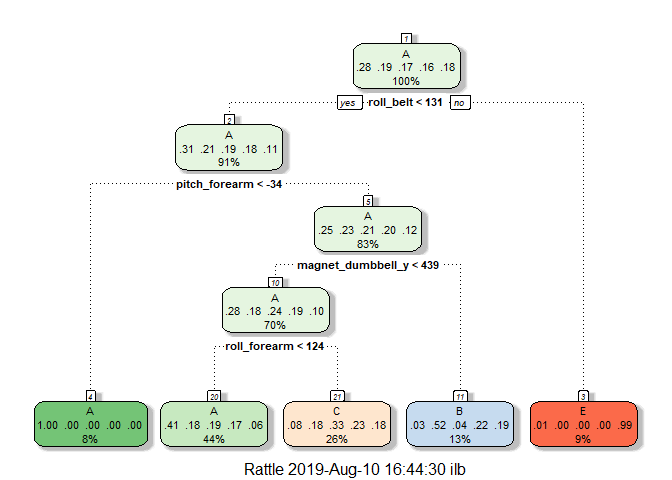

# Summary:
This assignment aims to develop a model that can predict if a barbell lift is being well executed or not. The data includes sensor measurements located in the belt, the forearm, the arm and the dumbell of 6 individuals. Each of the 6 individuals performed barbell lifts in 5 different ways, 1 in a correct manner (class A), and 4 in an incorrect manner (class B, C, D and E). The training data includes 19622 observations of 159 variables, whereas the testing data includes 20 observations of 159 variables. 


# Packages and data


## Cleaning and treating both training and test data

```r
#import data
training <- read.csv(file = "pml-training.csv",header = T, sep = ",", row.names = 1, na.strings=c("NA","#DIV/0!",""))
#format date and time
training$cvtd_timestamp <- parse_date_time(training$cvtd_timestamp , orders="dmy HMS")
#remove userID to aviod correlation between classe and user
training <- training[,-1]

#remove near zero variables
DataNZV <- nearZeroVar(training, saveMetrics=TRUE) 
training <- training[,DataNZV$nzv  == "FALSE"]

#remove variables with > 50% NA values
NAColum <- colSums(is.na(training))/nrow(training) >0.5
training <- training[,NAColum == "FALSE"]
#repeat the same transformations on the testing data
test <- read.csv(file = "pml-testing.csv",header = T, sep = ",", row.names = 1, na.strings=c("NA","#DIV/0!",""))
test$cvtd_timestamp <- parse_date_time(test$cvtd_timestamp , orders="dmy HMS")
test <- test[,-1]
test <- test[,DataNZV$nzv  == "FALSE"]
test <- test[,NAColum == "FALSE"]
#dimensions of training and test after dimensioning
training <- as.data.frame(training)
test <- as.data.frame(test)
dim(training); dim(test)
```

```
## [1] 19622    57
```

```
## [1] 20 57
```

#Model creation and evaluation

```r
#creating traing and testing data
inTrain <- createDataPartition(y = training$classe, p = 0.7, list = F)
trainingData <- training[inTrain,]
testingData <- training[-inTrain,]

set.seed(1777)
#Model 1: Rpart
mod1 <- train(classe ~., data = trainingData, method = "rpart")
fancyRpartPlot(mod1$finalModel)
```

<!-- -->

```r
pred1 <- predict(mod1,testingData)
confusionMatrix(pred1, testingData$classe)
```

```
## Confusion Matrix and Statistics
## 
##           Reference
## Prediction    A    B    C    D    E
##          A 1520  500  466  408  180
##          B   29  364   35  183  155
##          C  122  275  525  373  299
##          D    0    0    0    0    0
##          E    3    0    0    0  448
## 
## Overall Statistics
##                                           
##                Accuracy : 0.4855          
##                  95% CI : (0.4726, 0.4983)
##     No Information Rate : 0.2845          
##     P-Value [Acc > NIR] : < 2.2e-16       
##                                           
##                   Kappa : 0.3273          
##                                           
##  Mcnemar's Test P-Value : NA              
## 
## Statistics by Class:
## 
##                      Class: A Class: B Class: C Class: D Class: E
## Sensitivity            0.9080  0.31958  0.51170   0.0000  0.41405
## Specificity            0.6310  0.91530  0.78000   1.0000  0.99938
## Pos Pred Value         0.4945  0.47520  0.32936      NaN  0.99335
## Neg Pred Value         0.9452  0.84860  0.88324   0.8362  0.88333
## Prevalence             0.2845  0.19354  0.17434   0.1638  0.18386
## Detection Rate         0.2583  0.06185  0.08921   0.0000  0.07613
## Detection Prevalence   0.5223  0.13016  0.27086   0.0000  0.07664
## Balanced Accuracy      0.7695  0.61744  0.64585   0.5000  0.70671
```

```r
#Model 2: Boosters gbm
mod2 <- train(classe ~., data = trainingData, method = "gbm", verbose = FALSE)
pred2 <- predict(mod2, testingData)
confusionMatrix(pred2, testingData$classe)
```

```
## Confusion Matrix and Statistics
## 
##           Reference
## Prediction    A    B    C    D    E
##          A 1673    2    0    0    0
##          B    1 1135    5    0    0
##          C    0    2 1018    5    0
##          D    0    0    3  957    4
##          E    0    0    0    2 1078
## 
## Overall Statistics
##                                           
##                Accuracy : 0.9959          
##                  95% CI : (0.9939, 0.9974)
##     No Information Rate : 0.2845          
##     P-Value [Acc > NIR] : < 2.2e-16       
##                                           
##                   Kappa : 0.9948          
##                                           
##  Mcnemar's Test P-Value : NA              
## 
## Statistics by Class:
## 
##                      Class: A Class: B Class: C Class: D Class: E
## Sensitivity            0.9994   0.9965   0.9922   0.9927   0.9963
## Specificity            0.9995   0.9987   0.9986   0.9986   0.9996
## Pos Pred Value         0.9988   0.9947   0.9932   0.9927   0.9981
## Neg Pred Value         0.9998   0.9992   0.9984   0.9986   0.9992
## Prevalence             0.2845   0.1935   0.1743   0.1638   0.1839
## Detection Rate         0.2843   0.1929   0.1730   0.1626   0.1832
## Detection Prevalence   0.2846   0.1939   0.1742   0.1638   0.1835
## Balanced Accuracy      0.9995   0.9976   0.9954   0.9957   0.9979
```

Model 2 is the best with an accuracy of 0.99.

# Quizz

```r
predTest <- predict(mod2, test)
data.frame(test$problem_id, predTest)
```

```
##    test.problem_id predTest
## 1                1        B
## 2                2        A
## 3                3        B
## 4                4        A
## 5                5        A
## 6                6        E
## 7                7        D
## 8                8        B
## 9                9        A
## 10              10        A
## 11              11        B
## 12              12        C
## 13              13        B
## 14              14        A
## 15              15        E
## 16              16        E
## 17              17        A
## 18              18        B
## 19              19        B
## 20              20        B
```

